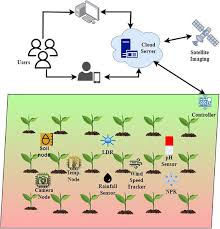

# Smart India Hackathon Workshop
# Date:25/09/2025
## Register Number:25017569
## Name:Vijiyalakshmi A
## Problem Title
SIH 25010: Smart Crop Advisory System for Small and Marginal Farmers
## Problem Description
A majority of small and marginal farmers in India rely on traditional knowledge, local shopkeepers, or guesswork for crop selection, pest control, and fertilizer use. They lack access to personalized, real-time advisory services that account for soil type, weather conditions, and crop history. This often leads to poor yield, excessive input costs, and environmental degradation due to overuse of chemicals. Language barriers, low digital literacy, and absence of localized tools further limit their access to modern agri-tech resources.

Impact / Why this problem needs to be solved

Helping small farmers make informed decisions can significantly increase productivity, reduce costs, and improve livelihoods. It also contributes to sustainable farming practices, food security, and environmental conservation. A smart advisory solution can empower farmers with scientific insights in their native language and reduce dependency on unreliable third-party advice.

Expected Outcomes

• A multilingual, AI-based mobile app or chatbot that provides real-time, location-specific crop advisory.
• Soil health recommendations and fertilizer guidance.
• Weather-based alerts and predictive insights.
• Pest/disease detection via image uploads.
• Market price tracking.
• Voice support for low-literate users.
• Feedback and usage data collection for continuous improvement.

Relevant Stakeholders / Beneficiaries

• Small and marginal farmers
• Agricultural extension officers
• Government agriculture departments
• NGOs and cooperatives
• Agri-tech startups

Supporting Data

• 86% of Indian farmers are small or marginal (NABARD Report, 2022).
• Studies show ICT-based advisories can increase crop yield by 20–30%.

## Problem Creater's Organization
Government of Punjab

## Theme
Agriculture, FoodTech & Rural Development

## Proposed Solution
1. Use real-time soil, weather, and historical crop data to recommend the most suitable crops.

2. Provide customized advice on fertilizers, pesticides, and irrigation based on soil and crop conditions.

3. Deliver advisory through a mobile app and SMS in regional languages.

## Diagram

## Technical Approach
1. Mobile phones can give farmers tips and alerts about crops, weather, and pests.

2. Sensors in fields can check soil moisture and crop health.

3. Computer analysis (AI) can suggest the best crop, fertilizer, and irrigation methods.

## Feasibility and Viability
1. Easy to set up with available technology.

2. Farmers can access it through simple mobile phones.

3. Needs low-cost tools like sensors and SMS alerts.

## Impact and Benefits
1. Farmers get correct and timely advice for crops.

2. Crop losses from pests and weather reduce.

3. Better decision-making improves farm productivity.

## Research and References
1. Research shows mobile apps and SMS help farmers get crop and weather advice.

2. Studies say sensors in fields improve crop health and reduce losses.

3. Case studies in India prove farmers earn more with smart advisory systems.

